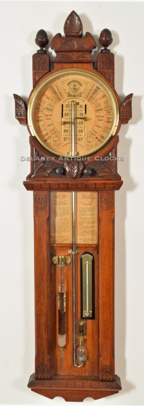
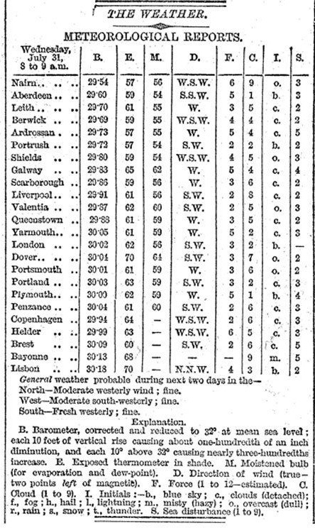
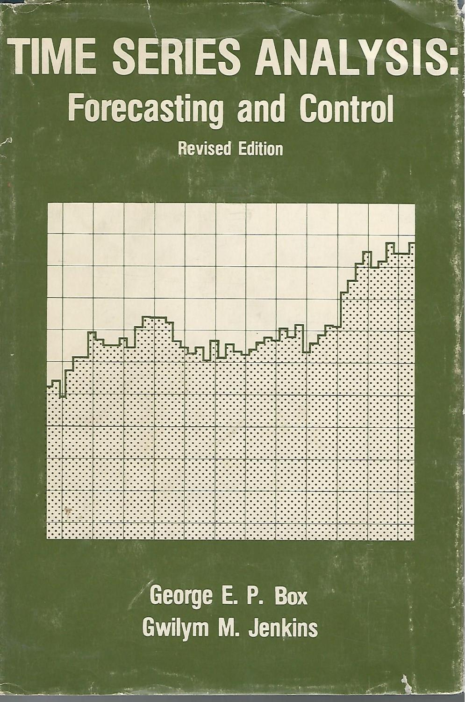

```{r setup, include=FALSE}
knitr::opts_chunk$set(cache = T, message = F, comment = NA, fig.align = "center")
```


<style>
  .espacio {
     margin-bottom: 1cm;
  }
</style>

# Series de tiempo 📉📈

> "It is far better to foresee even without certainty than not to foresee at all." --- Henri Poincare


# Prediciendo los pronósticos

La estadística es una ciencia muy joven. El progreso en el análisis de datos y en particular en las
series de tiempo siempre ha dependido en gran medida de cuándo, dónde y cómo estaban 
disponibles los datos y en qué cantidad.

En la época Victoriana un científico llamado Robert FitzRoy fue nombrado jefe de un nuevo departamento
del gobierno británico para registrar y publicar datos relacionados con el clima para los marineros.
FitRoy había trabajado como capitán del HMS Beagle durante el viaje que llevó a Charles Darwin
alrededor del mundo. Este viaje fue instrumental en proporcionar evidencia a Darwin para la teoría 
de la evolución por selección natural.

Desde el renacimiento, los científicos comenzaron a recopilar datos relacionados con el clima con 
la ayuda de instrumentos recién inventados, como el barómetro, para medir el estado atmosférico. Esto
con el objetivo de emplearlos para la pesca, la agricultura, o la ganadería.

Para _predecir_ el clima se analizaba la aparición de nubes o bien el comportamiento de los animales,
por ejemplo, el toro en el campo de un granjero, una rana en un frasco, o una golondrina en un arbusto
para ver, por ejemplo, si se aproximaba una tormenta.

<div style="text-align: center;">**Predicción del clima usando ranas**</div>
<center></center>
<p class="espacio">
</p>

Se modernizaron los barómetros y estos instrumentos los utilizaron para registrar series de tiempo a
intervalos diarios o incluso por hora. Los datos se guardaban en diarios privados y libros de
registro locales de la ciudad.

<center></center>
<p class="espacio">
</p>

Un problema grande para FitzRoy era que se hundían los barcos. Entre 1866 y 1860 se hundieron
7402 barcos y se perdieron 7201 vidas. FitzRoy creía que si se podía prever esto muchas vidas
se hubieran salvado. Cuando se hundió el Royal Charter en 1859 le dieron la facultad de comenzar 
a emitir advertencias de tormenta.

FitzRoy acuñó el término *pronóstico*. En ese momento, fue criticado por la calidad de sus
pronósticos, pero ahora se considera que estaba adelantado a su época. 
Estableció la costumbre de imprimir pronósticos del tiempo en el periódico _The Times_.

<center></center>
<p class="espacio">
</p>

Leer más en: https://www.bbc.com/news/magazine-32483678

```{r,message=FALSE,comment=NA,results='hide',echo=FALSE}
library(tidyverse)
library(reshape2)
library(gridExtra)
knitr::opts_chunk$set(comment=NA, fig.align="center")
```


<style>
  .espacio {
     margin-bottom: 1cm;
  }
</style>

## El despegue de las series de tiempo

Los desarrollos teóricos en el análisis de series de tiempo comenzaron con procesos estocásticos.
La primera aplicación real de los modelos que se usan actualmente a los datos comenzó en el
trabajo de G. U Yule y J. Walker en las décadas de 1920 y 1930, pero el problema es que no se
lograba encontrar una solución de máxima verosimilitud para una clase de modelos más generales.

Tomó hasta 1970 antes de que esto se lograra. En ese momento, salió el clásico libro "Análisis de
series temporales" de G. E. P. Box y G. M. Jenkins, que contiene el procedimiento de modelado completo
para series individuales: especificación, estimación, diagnóstico y pronóstico.

Hoy en día, los denominados modelos Box-Jenkins son quizás los más utilizados y muchas técnicas
utilizadas para la predicción y el ajuste estacional se remontan a estos modelos.

<center></center>
<p class="espacio">
</p>

### Modelos aditivos:

El enfoque de series de tiempo como modelo aditivo es de la siguiente manera. 
Supongamos que tenemos una serie de tiempo en la cual observamos "ciclos".
A esto normalmente se le llama "descomposición tendencia-ciclo".


Por lo tanto, pensamos que una serie de tiempo comprende tres componentes: un componente 
de ciclo de tendencia, un componente estacional y un componente restante (que contiene
cualquier otra cosa en la serie de tiempo).

Si suponemos una descomposición aditiva, entonces podemos escribir:

$$
y_t = S_t + T_t + R_t
$$
donde $y_t$ son los datos, $S_t$ es la compnente estacional, $T_t$ es la componente de
tendencia-ciclo, y $R_t$ es la componente de residuo, todos en un periodo $t$.

Alternativamente, una descomposición multiplicativa se escribiría como

$$
y_t = S_t \times T_t \times R_t.
$$
La descomposición aditiva es la más apropiada si la magnitud de las fluctuaciones estacionales,
o la variación alrededor del ciclo de tendencia, no varía con el nivel de la serie temporal.
Cuando la variación en el patrón estacional, o la variación alrededor del ciclo de tendencia,
parece ser proporcional al nivel de la serie de tiempo, entonces una descomposición
multiplicativa es más apropiada. Las descomposiciones multiplicativas son comunes con las
series de tiempo económicas.

Una alternativa al uso de una descomposición multiplicativa es transformar primero los datos
hasta que la variación en la serie parece ser estable en el tiempo, luego usar una
descomposición aditiva. Cuando se ha utilizado una transformación logarítmica, esto es
equivalente a usar una descomposición multiplicativa porque

$$
y_t=S_t\times T_t \times R_t \quad \mbox{es equivalente a }\quad \mbox{log}(y_t) = \mbox{log}(S_t)+ \mbox{log}(T_t) + \mbox{log}(R_t).
$$


### ¿Cómo hacemos análisis de series de tiempo?

Podemos usar el suavizamiento loess para entender y describir el comportamiento
de series de tiempo, en las cuales intentamos entender la dependencia de una
serie de mediciones indexadas por el tiempo. Típicamente es necesario utilizar 
distintas *componentes* para describir exitosamente una serie de tiempo, y para
esto usamos distintos tipos de suavizamientos. Veremos que distintas
*componentes* varían en distintas escalas de tiempo (unas muy lentas, cono la
tendencia, otras más rapidamente, como variación quincenal, etc.).

En el siguiente ejemplo consideramos la ventas semanales de un producto a lo 
largo de 5 años. Veamos que existe una tendencia a largo plazo (crecimientos
anuales) y también que existen patrones de variación estacionales.

```{r, fig.width=5.5, fig.height = 3}
ventas <- read_csv("datos/ventas_semanal.csv")
ggplot(ventas, aes(x = period, y = sales.kg)) + geom_line(size = 0.3)
```

Intentaremos usar suavizamiento para capturar los distintos tipos de variación
que observamos en la serie. En primer lugar, si suavizamos poco (por ejemplo
$\alpha = 0.1$), vemos que capturamos en parte la tendencia y en parte la 
variación estacional.

```{r, fig.width=5.5, fig.height = 3}
ggplot(ventas, aes(x = period, y = log(sales.kg))) +
  geom_line(size = 0.3) +
  geom_smooth(method = "loess", span = 0.1, se = FALSE, size = 1, 
    color = "red")
```

Es mejor comenzar capturando la tendencia, y poco de la componente estacional:

```{r, fig.width=5.5, fig.height = 3}
ggplot(ventas, aes(x = period, y = log(sales.kg))) +
  geom_line(size = 0.3) +
  geom_smooth(method = "loess", span = 0.3, se = FALSE, size = 1, 
    color = "red")

ajuste.trend.1 <- loess(log(sales.kg) ~ period, ventas, span = 0.3)
ventas$trend.1 <- ajuste.trend.1$fitted
ventas$res.trend.1 <- ajuste.trend.1$residuals
```

Ahora calculamos los residuales de este ajuste e intentamos describirlos 
mediante un suavizamiento más fino. Verificamos que hemos estimado la mayor
parte de la tendencia, e intentamos capturar la variación estacional de los 
residuales.

```{r, fig.width=5.5, fig.height = 3}
ggplot(ventas, aes(x = period, y = res.trend.1)) +
  geom_line(size = 0.3) +
  geom_smooth(method = "loess", span = 0.15, se = FALSE, size = 1, color = "red")

ajuste.est1.1 <- loess(res.trend.1 ~ period, ventas, span = 0.15, degree = 1)
ventas$est1.1 <- ajuste.est1.1$fitted
ventas$res.est1.1 <- ajuste.est1.1$residuals
```

Y graficamos los residuales obtenidos después de ajustar el componente 
estacional para estudiar la componente de mayor frecuencia.

```{r, fig.width=5.5, fig.height = 3}
ggplot(ventas, aes(x = period, y = res.est1.1)) +
  geom_line(size = 0.3) +
  geom_smooth(method = "loess", span = 0.06, se = FALSE, size = 1, 
    color = "red")

ajuste.est2.1 <- loess(res.est1.1 ~ period, ventas, span = 0.06, degree = 1)
ventas$est2.1 <- ajuste.est2.1$fitted
ventas$res.est2.1 <- ajuste.est2.1$residuals
```

Ahora que tenemos nuestra primera estimación de cada una de las componentes, 
podemos regresar a hacer una mejor estimación de la tendencia. La ventaja de 
volver es que ahora podemos suavizar más sin que en nuestra muestra compita
tanto la variación estacional. Por tanto podemos suavizar menos:

```{r, fig.width=5.5, fig.height = 3}
ventas$sales.sin.est.1 <- log(ventas$sales.kg) - ajuste.est1.1$fitted - 
  ajuste.est2.1$fitted

ggplot(ventas, aes(x = period, y = sales.sin.est.1)) +
  geom_line(size = 0.3) +
  geom_smooth(method = "loess", span = 0.08, se = FALSE, size = 1, color = "red")

ajuste.trend.2 <- loess(sales.sin.est.1 ~ period, ventas, span = 0.08, degree = 1)
ventas$trend.2 <- ajuste.trend.2$fitted
ventas$res.trend.2 <- log(ventas$sales.kg) - ventas$trend.2
```

Y ahora nos concentramos en la componente anual.

```{r, fig.width=5.5, fig.height = 3}
ventas$sales.sin.est.2 <- log(ventas$sales.kg) - ajuste.trend.2$fitted -
  ajuste.est2.1$fitted
ggplot(ventas, aes(x = period, y = sales.sin.est.2)) +
  geom_line(size = 0.3) +
  geom_smooth(method = "loess", span = 0.2, se = FALSE, size = 1, color = "red")

ajuste.est1.2 <- loess(sales.sin.est.2 ~ period, ventas, span = 0.15, degree = 1)
ventas$est1.2 <- ajuste.est1.2$fitted
ventas$res.est1.2 <- ajuste.est1.2$residuals
```

Finalmente volvemos a ajustar la componente de frecuencia más alta:

```{r, fig.width=5.5, fig.height = 3}
ventas$sales.sin.est.3 <- log(ventas$sales.kg) - ajuste.trend.2$fitted -
  ajuste.est1.2$fitted

ggplot(ventas, aes(x = period, y = sales.sin.est.3)) +
  geom_line(size = 0.3) +
  geom_smooth(method = "loess", span = 0.06, se = FALSE, size = 1, 
    color = "red")

ajuste.est2.2 <- loess(sales.sin.est.3 ~ period, ventas, span = 0.06, degree = 1)
ventas$est2.2 <- ajuste.est2.2$fitted
ventas$res.est2.2 <- ajuste.est2.2$residuals
```

Verificamos nuestra descomposición y visualizamos el ajuste:

```{r, fig.width = 5.5, fig.height = 7}
ventas$log.sales <- log(ventas$sales.kg)
ventas.2 <- dplyr::select(ventas, period, trend.2, est1.2, est2.2, res.est2.2, 
  log.sales)
#max(abs(apply(ventas.2[, 2:4], 1, sum) - ventas.2$log.sales))

ventas.2.m <- gather(ventas.2, componente, valor, -period)

ventas.2.m.c <- ventas.2.m %>%
  group_by(componente) %>%
  mutate(
    valor.c = valor - mean(valor)
  )

ggplot(ventas.2.m.c, aes(x = period, y = valor.c)) +
  geom_vline(xintercept = c(0, 52 - 1, 52 * 2 - 1, 52 * 3 - 1, 52 * 4 - 1), color = "gray") +
  geom_line(size = 0.3) +
  facet_wrap(~ componente, ncol = 1)
```

Y vemos que es razonable describir los residuales con una distribución normal 
(con desviación estándar alrededor de 8% sobre el valor ajustado):

```{r, fig.width=3.6, fig.height=3.6}
#sd(ventas$res.est2.2)
ventas.ord <- arrange(ventas, res.est2.2)
ventas.ord$q.normal <- qnorm((1:nrow(ventas) - 0.5) / nrow(ventas))
ggplot(ventas.ord, aes(x = q.normal, y = res.est2.2)) +
  geom_point(size = 1.2) +
  geom_smooth(method = "lm")
```

Hay dos cosas que nos falta explicar, en primer lugar, las caídas alrededor de
principios/finales de cada año (que son de hasta -0.2), y segundo que esta 
gráfica parece oscilar demasiado. La estructura que aún no hemos explicado se
debe a que las semanas que caen en quincena tienden a tener compras más 
grandes que las que están justo antes de quincena o fin de mes.

Por el momento detendremos el análisis aquí y explicamos un proceso iterativo
para proceder en nuestro análisis exploratorio:

<p class="espacio">
</p>
<div class="title_box">
<p class="espacio">
</p>
&nbsp;&nbsp;&nbsp;**Iterando ajuste de loess.** 

&nbsp;&nbsp;Cuando queremos ajustar con tres componentes: tendencia, estacionalidad y residuales, podemos seguir el siguiente proceso,

1. Ajustar la primera componente a los datos (tendencia).

2. Ajustar la segunda componente a los residuales del paso anterior 
(estacionalidad).

3. Restar de los datos originales la segunda componente ajustada 
(estacionalidad).

4. Ajustar a los residuales del paso anterior una nueva componente (tendencia).

5. Restar a los datos originales la componente ajustada en el paso anterior.

6. Ajustar a los residuales del paso anterior una nueva componente 
(estacionalidad).

7. Checar ajuste y si es necesario iterar de 3 a 6 con las nuevas componentes.
<p class="espacio">
</p>
</div>
<p class="espacio">
</p>
<p class="espacio">
</p>


La idea es que cada componente compite para explicar los datos (cada una gana
más al bajar el parámetro $\alpha$). El conflicto es que si suavizamos mucho
cada componente (por ejemplo la tendencia), entonces parte de la variación 
que debería ir en ella queda en los residuales, y se intenta ajustar 
posteriormente por una componente distinta (estacionalidad). Sin embargo, si 
suavizamos poco, entonces parte de la variación de la segunda componente es
explicada por el ajuste de la primera. Entonces, la solución es ir poco a poco
adjudicando variación a cada componente. En nuestro ejemplo de arriba, podemos
comenzar suavizando de menos el primer ajsute de la tendencia, luego ajustar
estacionalidad, restar a los datos originales esta estacionalidad, y ajustar a
estos datos una componente más suave de tendencia. Es posible suavizar más la
tendencia justamente porque ya hemos eliminado una buena parte de la
estacionalidad.

Ahora, si vemos cómo se comportan los residuales según el día donde comienza la
semana, vemos el patrón que explicamos antes:

```{r, fig.width = 4, fig.height=3.8}
dat.tot <- read_csv(file = "datos/cereal_tot.csv")
ventas.day <- inner_join(ventas,dplyr::select(dat.tot, period, day),by='period')
```

```{r, message=FALSE, warning=FALSE, comment=NA, fig.width = 4, fig.height=3.8}
ggplot(ventas.day, aes(x = day, y = res.est2.2)) +
  geom_point() +
  ylab("residual") +
  geom_smooth(method = "loess", span = 0.06, se = FALSE, size = 1, color = "red")
```


Podemos hacer un ajuste loess con estos residuales:

```{r, fig.width=5.5, fig.height = 3}
ajuste.quincenas <- loess(res.est2.2 ~ day, data = ventas.day)
ventas$quincena <- ajuste.quincenas$fitted
ventas$res.final <- ajuste.quincenas$residuals
sd(ventas$quincena)
sd(ventas$res.final)

ggplot(ventas, aes(x = period, y = res.final)) +
  geom_line(size = 0.3) +
  geom_point(size = 1.2)
```

```{r, fig.width = 5.5, fig.height = 7}
ventas.2 <- dplyr::select(ventas, period, trend.2, est1.2, est2.2, quincena, 
  res.final, log.sales)
max(abs(apply(ventas.2[, 2:4], 1, sum) - ventas.2$log.sales))

ventas.2.m <- gather(ventas.2, componente, valor, -period)

ventas.2.m.c <- ventas.2.m %>%
  group_by(componente) %>%
  mutate(
    valor.c = valor - mean(valor)
  )

ggplot(ventas.2.m.c, aes(x = period, y = valor.c)) +
  geom_vline(xintercept = c(0, 52 - 1, 52 * 2 - 1, 52 * 3 - 1, 52 * 4 - 1), color = "gray") +
  geom_line(size = 0.3) +
  facet_wrap(~ componente, ncol = 1)
```


```{r}
library(nullabor)
ventas.res.2 <- dplyr::select(ventas, period, res.final)
ventas.null.2 <- lineup(null_dist(var = 'res.final', dist = 'normal', 
  params = list(mean = 0, sd = 0.0636)), n = 20, ventas.res.2)

ggplot(ventas.null.2, aes(x = period, y = res.final)) +
  facet_wrap(~ .sample, ncol = 2) + 
  geom_line(size = 0.3) +
  geom_vline(xintercept = c(0, 52 - 1, 52 * 2 - 1, 52 * 3 - 1, 52 * 4 - 1), 
             color = "gray") + 
  geom_point(size = 1.2) 
```


### asdfaf


```{r}
library(fpp3)
elecequip %>% decompose(type="multiplicative") %>%
  autoplot() + xlab("Year") +
  ggtitle("Classical multiplicative decomposition
    of electrical equipment index")
```


## Modelos adivitos con #prophet

blah blah blah


```{r message=FALSE, warning=FALSE}
library(wikipediatrend)
library(tidyverse)

#page_views <- wp_trend("Influenza", from = "2007-01-01", to = "2020-03-17")  %>% filter(views > 0)
#write_csv(x = page_views, path = "datos/influenza.csv")

page_views <- read_csv(file = "datos/influenza.csv")

ggplot(page_views, aes(x=date, y=log(views))) + 
  geom_point(size=0.8, alpha=0.5, colour="#2dcccd") + 
  geom_smooth(method="loess", colour="#00000000", fill="steelblue", alpha=1, span = 0.1) +
  scale_y_continuous( breaks=seq(5e6, 50e6, 5e6) , 
  label= paste(seq(5,50,5),"M") ) + xlab("Fecha") + ylab("Número de visitas (log)") +
  theme_bw()
```

```{r}
library(AnomalyDetection)

page_views_br <- page_views %>% 
  select(date, views) %>% 
  mutate(views = log(views)) %>%
  rename(timestamp = date) %>% 
  mutate(timestamp = as.POSIXct(timestamp))

res <- 
AnomalyDetectionTs(
  x         = page_views_br, 
  alpha     = 0.05, 
  max_anoms = 0.40,
  direction = "both"
)$anoms

res$timestamp <- as.Date(res$timestamp)

head(res)
```

```{r}
page_views <- 
  page_views %>% 
  mutate(normal = !(page_views$date %in% res$timestamp))  %>% 
  mutate(anom   =   page_views$date %in% res$timestamp )

class(page_views) <- c("wp_df", "data.frame")
```

```{r}
ggplot(data = page_views, aes(x=date, y=views)) + 
      geom_line(color="steelblue") +
      geom_point(data=filter(page_views, anom==T), color="red2", size=2) +
      theme_bw() + xlab("Fecha") + ylab("Número de visitas") + ggtitle("Observaciones anómalas")
```

```{r message=FALSE, warning=FALSE, results='hide'}
library(prophet)
page_views_p <- dplyr::rename(page_views, ds = date, y = views)
m <- prophet(page_views_p)
future <- make_future_dataframe(m, periods = 1095)
#head(future)
forecast <- predict(m, future)
#head(forecast)
```

```{r}
plot(m, forecast)
```

Podemos graficar los componentes del modelo:

```{r}
prophet_plot_components(m, forecast)
```


## Algunos conceptos


### ¿Cuál de las siguientes dos series es estacionaria?

```{r}
page_views_pm1 <- wp_trend("Peyton_Manning", from = "2016-01-01", to = "2020-03-18")
page_views_pm2 <- wp_trend("Patrick_Mahomes", from = "2016-01-01", to = "2020-03-18")

gpm1 <- ggplot(page_views_pm1, aes(x=date, y=log(views))) + 
  geom_point(size=1.5, colour="steelblue") + 
  geom_smooth(method="loess", colour="#2dcccd", fill="#2dcccd", alpha=0.4, span = 0.1) +
  scale_y_continuous( breaks=seq(5e6, 50e6, 5e6) , 
  label= paste(seq(5,50,5),"M") ) + xlab("Fecha") + ylab("Número de visitas (log)") +
  ggtitle("Payton Manning") +
  theme_bw()

gpm2 <- ggplot(page_views_pm2, aes(x=date, y=log(views))) + 
  geom_point(size=1.5, colour="steelblue") + 
  geom_smooth(method="loess", colour="#2dcccd", fill="#2dcccd", alpha=0.4, span = 0.1) +
  scale_y_continuous( breaks=seq(5e6, 50e6, 5e6) , 
  label= paste(seq(5,50,5),"M") ) + xlab("Fecha") + ylab("Número de visitas (log)") +
  ggtitle("Patrick Mahomes") +
  theme_bw()
gpm2
grid.arrange(gpm1, gpm2, ncol = 2)
```

a) Payton
b) Patrick
c) Ambos
d) Ninguno


## Ejemplos en python
https://stackoverflow.com/questions/36437028/graphing-matplotlib-with-python-code-in-a-r-markdown-document


```{r}
path_java <- "/mnt/c/ProgramData/Anaconda3/"
```


# Referencias 

[1] Aileen Nielsen (2019). Practical Time Series Analysis. O'Reilly.

[2] Box, G. E., & Jenkins, G. M. (1970). Time series analysis: Forecasting and control Holden-Day. San Francisco, 498.

[3] Hyndman, R. J., & Athanasopoulos, G. (2018). Forecasting: principles and practice. OTexts.

[4] Peter Meissner (2019). wikipediatrend: Public Subject Attention via Wikipedia Page View Statistics. R
  package version 2.1.4.

[5] Owen S. Vallis, Jordan Hochenbaum and Arun Kejariwal (2014). AnomalyDetection: Anomaly Detection Using Seasonal Hybrid Extreme Studentized Deviate Test. R package version 1.0.1.

[6] Wickham, H., & Grolemund, G. (2016). R for data science.

[7] Guerrero Guzmán, V. M. (2003). Análisis estadístico de series de tiempo económicas (No. 04; Q280, G8 2003.).

[8] 


https://towardsdatascience.com/detecting-stationarity-in-time-series-data-d29e0a21e638
https://towardsdatascience.com/stationarity-in-time-series-analysis-90c94f27322
https://machinelearningmastery.com/time-series-data-stationary-python/
https://towardsdatascience.com/time-series-analysis-in-python-an-introduction-70d5a5b1d52a
https://machinelearningmastery.com/time-series-forecasting-methods-in-python-cheat-sheet/
https://github.com/WillKoehrsen/Data-Analysis/blob/master/additive_models/Additive%20Models%20for%20Prediction.ipynb

prophet
https://research.fb.com/prophet-forecasting-at-scale/
