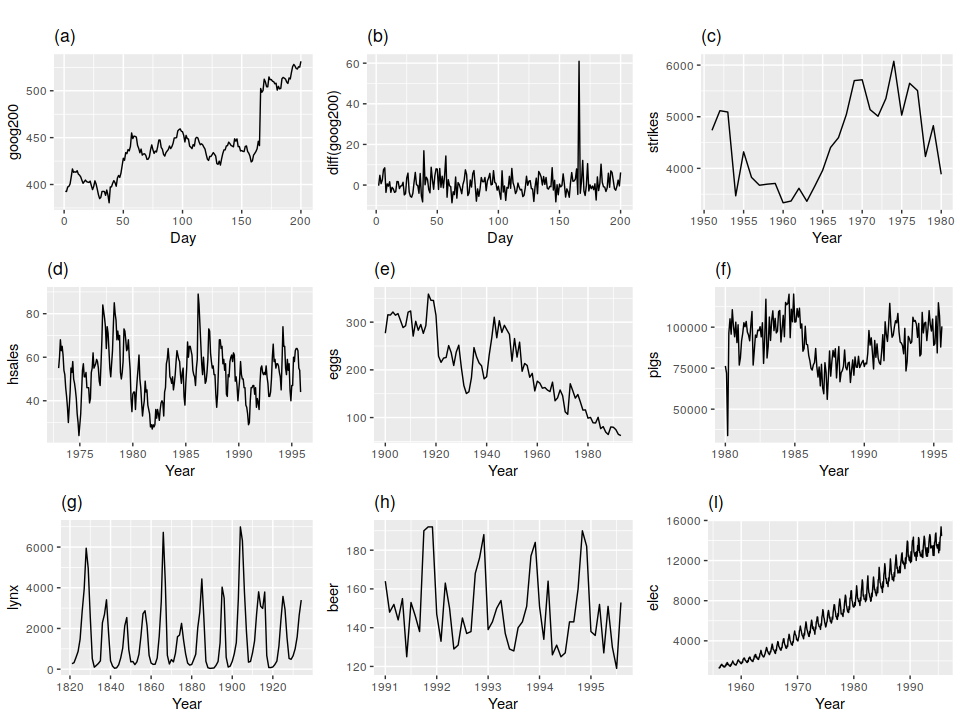
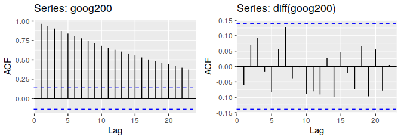

```{r setup, include=FALSE}
knitr::opts_chunk$set(cache = T, message = F, comment = NA, fig.align = "center")
```


<style>
  .espacio {
     margin-bottom: 1cm;
  }
</style>

# Series de tiempo 📉📈

> "It is far better to foresee even without certainty than not to foresee at all." --- Henri Poincare


# Prediciendo los pronósticos

La estadística es una ciencia muy joven. El progreso en el análisis de datos y en particular en las
series de tiempo siempre ha dependido en gran medida de cuándo, dónde y cómo estaban 
disponibles los datos y en qué cantidad.

En la época Victoriana un científico llamado Robert FitzRoy fue nombrado jefe de un nuevo departamento
del gobierno británico para registrar y publicar datos relacionados con el clima para los marineros.
FitRoy había trabajado como capitán del HMS Beagle durante el viaje que llevó a Charles Darwin
alrededor del mundo. Este viaje fue instrumental en proporcionar evidencia a Darwin para la teoría 
de la evolución por selección natural.

Desde el renacimiento, los científicos comenzaron a recopilar datos relacionados con el clima con 
la ayuda de instrumentos recién inventados, como el barómetro, para medir el estado atmosférico. Esto
con el objetivo de emplearlos para la pesca, la agricultura, o la ganadería.

Para _predecir_ el clima se analizaba la aparición de nubes o bien el comportamiento de los animales,
por ejemplo, el toro en el campo de un granjero, una rana en un frasco, o una golondrina en un arbusto
para ver, por ejemplo, si se aproximaba una tormenta.

<div style="text-align: center;">**Predicción del clima usando ranas**</div>
<center></center>
<p class="espacio">
</p>

Se modernizaron los barómetros y estos instrumentos los utilizaron para registrar series de tiempo a
intervalos diarios o incluso por hora. Los datos se guardaban en diarios privados y libros de
registro locales de la ciudad.

<center></center>
<p class="espacio">
</p>

Un problema grande para FitzRoy era que se hundían los barcos. Entre 1866 y 1860 se hundieron
7402 barcos y se perdieron 7201 vidas. FitzRoy creía que si se podía prever esto muchas vidas
se hubieran salvado. Cuando se hundió el Royal Charter en 1859 le dieron la facultad de comenzar 
a emitir advertencias de tormenta.

FitzRoy acuñó el término *pronóstico*. En ese momento, fue criticado por la calidad de sus
pronósticos, pero ahora se considera que estaba adelantado a su época. 
Estableció la costumbre de imprimir pronósticos del tiempo en el periódico _The Times_.

<center></center>
<p class="espacio">
</p>

Leer más en: https://www.bbc.com/news/magazine-32483678

```{r message=FALSE, warning=FALSE}
library(tidyverse)
library(reshape2)
library(gridExtra)
knitr::opts_chunk$set(comment=NA, fig.align="center")
```


<style>
  .espacio {
     margin-bottom: 1cm;
  }
</style>

## El despegue de las series de tiempo

Los desarrollos teóricos en el análisis de series de tiempo comenzaron con procesos estocásticos.
La primera aplicación real de los modelos que se usan actualmente a los datos comenzó en el
trabajo de G. U Yule y J. Walker en las décadas de 1920 y 1930, pero el problema es que no se
lograba encontrar una solución de máxima verosimilitud para una clase de modelos más generales.

Tomó hasta 1970 antes de que esto se lograra. En ese momento, salió el clásico libro "Análisis de
series temporales" de G. E. P. Box y G. M. Jenkins, que contiene el procedimiento de modelado completo
para series individuales: especificación, estimación, diagnóstico y pronóstico.

Hoy en día, los denominados modelos Box-Jenkins son quizás los más utilizados y muchas técnicas
utilizadas para la predicción y el ajuste estacional se remontan a estos modelos.

<center></center>
<p class="espacio">
</p>

### Modelos aditivos

El enfoque de series de tiempo como modelo aditivo es de la siguiente manera. 
Supongamos que tenemos una serie de tiempo en la cual observamos "ciclos".
A esto normalmente se le llama "descomposición tendencia-ciclo".


Por lo tanto, pensamos que una serie de tiempo comprende tres componentes: un componente 
de ciclo de tendencia, un componente estacional y un componente restante (que contiene
cualquier otra cosa en la serie de tiempo).

Si suponemos una descomposición aditiva, entonces podemos escribir:

$$
y_t = S_t + T_t + R_t
$$
donde $y_t$ son los datos, $S_t$ es la compnente estacional, $T_t$ es la componente de
tendencia-ciclo, y $R_t$ es la componente de residuo, todos en un periodo $t$.

Alternativamente, una descomposición multiplicativa se escribiría como

$$
y_t = S_t \times T_t \times R_t.
$$
La descomposición aditiva es la más apropiada si la magnitud de las fluctuaciones estacionales,
o la variación alrededor del ciclo de tendencia, no varía con el nivel de la serie temporal.
Cuando la variación en el patrón estacional, o la variación alrededor del ciclo de tendencia,
parece ser proporcional al nivel de la serie de tiempo, entonces una descomposición
multiplicativa es más apropiada. Las descomposiciones multiplicativas son comunes con las
series de tiempo económicas.

Una alternativa al uso de una descomposición multiplicativa es transformar primero los datos
hasta que la variación en la serie parece ser estable en el tiempo, luego usar una
descomposición aditiva. Cuando se ha utilizado una transformación logarítmica, esto es
equivalente a usar una descomposición multiplicativa porque

$$
y_t=S_t\times T_t \times R_t \quad \mbox{es equivalente a }\quad \mbox{log}(y_t) = \mbox{log}(S_t)+ \mbox{log}(T_t) + \mbox{log}(R_t).
$$


### ¿Cómo hacemos análisis de series de tiempo?

Podemos usar el suavizamiento loess para entender y describir el comportamiento
de series de tiempo, en las cuales intentamos entender la dependencia de una
serie de mediciones indexadas por el tiempo. Típicamente es necesario utilizar 
distintas *componentes* para describir exitosamente una serie de tiempo, y para
esto usamos distintos tipos de suavizamientos. Veremos que distintas
*componentes* varían en distintas escalas de tiempo (unas muy lentas, cono la
tendencia, otras más rapidamente, como variación quincenal, etc.).

En el siguiente ejemplo consideramos la ventas semanales de un producto a lo 
largo de 5 años. Veamos que existe una tendencia a largo plazo (crecimientos
anuales) y también que existen patrones de variación estacionales.

```{r, fig.width=5.5, fig.height = 3}
ventas <- read_csv("datos/ventas_semanal.csv")
ggplot(ventas, aes(x = period, y = sales.kg)) + geom_line(size = 0.3)
```

Intentaremos usar suavizamiento para capturar los distintos tipos de variación
que observamos en la serie. En primer lugar, si suavizamos poco (por ejemplo
$\alpha = 0.1$), vemos que capturamos en parte la tendencia y en parte la 
variación estacional.

```{r, fig.width=5.5, fig.height = 3}
ggplot(ventas, aes(x = period, y = log(sales.kg))) +
  geom_line(size = 0.3) +
  geom_smooth(method = "loess", span = 0.1, se = FALSE, size = 1, 
    color = "red")
```

Es mejor comenzar capturando la tendencia, y poco de la componente estacional:

```{r, fig.width=5.5, fig.height = 3}
ggplot(ventas, aes(x = period, y = log(sales.kg))) +
  geom_line(size = 0.3) +
  geom_smooth(method = "loess", span = 0.3, se = FALSE, size = 1, 
    color = "red")

ajuste.trend.1 <- loess(log(sales.kg) ~ period, ventas, span = 0.3)
ventas$trend.1 <- ajuste.trend.1$fitted
ventas$res.trend.1 <- ajuste.trend.1$residuals
```

Ahora calculamos los residuales de este ajuste e intentamos describirlos 
mediante un suavizamiento más fino. Verificamos que hemos estimado la mayor
parte de la tendencia, e intentamos capturar la variación estacional de los 
residuales.

```{r, fig.width=5.5, fig.height = 3}
ggplot(ventas, aes(x = period, y = res.trend.1)) +
  geom_line(size = 0.3) +
  geom_smooth(method = "loess", span = 0.15, se = FALSE, size = 1, color = "red")

ajuste.est1.1 <- loess(res.trend.1 ~ period, ventas, span = 0.15, degree = 1)
ventas$est1.1 <- ajuste.est1.1$fitted
ventas$res.est1.1 <- ajuste.est1.1$residuals
```

Y graficamos los residuales obtenidos después de ajustar el componente 
estacional para estudiar la componente de mayor frecuencia.

```{r, fig.width=5.5, fig.height = 3}
ggplot(ventas, aes(x = period, y = res.est1.1)) +
  geom_line(size = 0.3) +
  geom_smooth(method = "loess", span = 0.06, se = FALSE, size = 1, 
    color = "red")

ajuste.est2.1 <- loess(res.est1.1 ~ period, ventas, span = 0.06, degree = 1)
ventas$est2.1 <- ajuste.est2.1$fitted
ventas$res.est2.1 <- ajuste.est2.1$residuals
```

Ahora que tenemos nuestra primera estimación de cada una de las componentes, 
podemos regresar a hacer una mejor estimación de la tendencia. La ventaja de 
volver es que ahora podemos suavizar más sin que en nuestra muestra compita
tanto la variación estacional. Por tanto podemos suavizar menos:

```{r, fig.width=5.5, fig.height = 3}
ventas$sales.sin.est.1 <- log(ventas$sales.kg) - ajuste.est1.1$fitted - 
  ajuste.est2.1$fitted

ggplot(ventas, aes(x = period, y = sales.sin.est.1)) +
  geom_line(size = 0.3) +
  geom_smooth(method = "loess", span = 0.08, se = FALSE, size = 1, color = "red")

ajuste.trend.2 <- loess(sales.sin.est.1 ~ period, ventas, span = 0.08, degree = 1)
ventas$trend.2 <- ajuste.trend.2$fitted
ventas$res.trend.2 <- log(ventas$sales.kg) - ventas$trend.2
```

Y ahora nos concentramos en la componente anual.

```{r, fig.width=5.5, fig.height = 3}
ventas$sales.sin.est.2 <- log(ventas$sales.kg) - ajuste.trend.2$fitted -
  ajuste.est2.1$fitted
ggplot(ventas, aes(x = period, y = sales.sin.est.2)) +
  geom_line(size = 0.3) +
  geom_smooth(method = "loess", span = 0.2, se = FALSE, size = 1, color = "red")

ajuste.est1.2 <- loess(sales.sin.est.2 ~ period, ventas, span = 0.15, degree = 1)
ventas$est1.2 <- ajuste.est1.2$fitted
ventas$res.est1.2 <- ajuste.est1.2$residuals
```

Finalmente volvemos a ajustar la componente de frecuencia más alta:

```{r, fig.width=5.5, fig.height = 3}
ventas$sales.sin.est.3 <- log(ventas$sales.kg) - ajuste.trend.2$fitted -
  ajuste.est1.2$fitted

ggplot(ventas, aes(x = period, y = sales.sin.est.3)) +
  geom_line(size = 0.3) +
  geom_smooth(method = "loess", span = 0.06, se = FALSE, size = 1, 
    color = "red")

ajuste.est2.2 <- loess(sales.sin.est.3 ~ period, ventas, span = 0.06, degree = 1)
ventas$est2.2 <- ajuste.est2.2$fitted
ventas$res.est2.2 <- ajuste.est2.2$residuals
```

Verificamos nuestra descomposición y visualizamos el ajuste:

```{r, fig.width = 5.5, fig.height = 7}
ventas$log.sales <- log(ventas$sales.kg)
ventas.2 <- dplyr::select(ventas, period, trend.2, est1.2, est2.2, res.est2.2, 
  log.sales)
#max(abs(apply(ventas.2[, 2:4], 1, sum) - ventas.2$log.sales))

ventas.2.m <- gather(ventas.2, componente, valor, -period)

ventas.2.m.c <- ventas.2.m %>%
  group_by(componente) %>%
  mutate(
    valor.c = valor - mean(valor)
  )

ggplot(ventas.2.m.c, aes(x = period, y = valor.c)) +
  geom_vline(xintercept = c(0, 52 - 1, 52 * 2 - 1, 52 * 3 - 1, 52 * 4 - 1), color = "gray") +
  geom_line(size = 0.3) +
  facet_wrap(~ componente, ncol = 1)
```

Y vemos que es razonable describir los residuales con una distribución normal 
(con desviación estándar alrededor de 8% sobre el valor ajustado):

```{r, fig.width=3.6, fig.height=3.6}
#sd(ventas$res.est2.2)
ventas.ord <- arrange(ventas, res.est2.2)
ventas.ord$q.normal <- qnorm((1:nrow(ventas) - 0.5) / nrow(ventas))
ggplot(ventas.ord, aes(x = q.normal, y = res.est2.2)) +
  geom_point(size = 1.2) +
  geom_smooth(method = "lm")
```

Hay dos cosas que nos falta explicar, en primer lugar, las caídas alrededor de
principios/finales de cada año (que son de hasta -0.2), y segundo que esta 
gráfica parece oscilar demasiado. La estructura que aún no hemos explicado se
debe a que las semanas que caen en quincena tienden a tener compras más 
grandes que las que están justo antes de quincena o fin de mes.

Por el momento detendremos el análisis aquí y explicamos un proceso iterativo
para proceder en nuestro análisis exploratorio:

<p class="espacio">
</p>
<div class="title_box">
<p class="espacio">
</p>
&nbsp;&nbsp;&nbsp;**Iterando ajuste de loess.** 

&nbsp;&nbsp;Cuando queremos ajustar con tres componentes: tendencia, estacionalidad y residuales, podemos seguir el siguiente proceso,

1. Ajustar la primera componente a los datos (tendencia).

2. Ajustar la segunda componente a los residuales del paso anterior 
(estacionalidad).

3. Restar de los datos originales la segunda componente ajustada 
(estacionalidad).

4. Ajustar a los residuales del paso anterior una nueva componente (tendencia).

5. Restar a los datos originales la componente ajustada en el paso anterior.

6. Ajustar a los residuales del paso anterior una nueva componente 
(estacionalidad).

7. Checar ajuste y si es necesario iterar de 3 a 6 con las nuevas componentes.


<p class="espacio">
</p>
</div>
<p class="espacio">
</p>
<p class="espacio">
</p>


La idea es que cada componente compite para explicar los datos (cada una gana
más al bajar el parámetro $\alpha$). El conflicto es que si suavizamos mucho
cada componente (por ejemplo la tendencia), entonces parte de la variación 
que debería ir en ella queda en los residuales, y se intenta ajustar 
posteriormente por una componente distinta (estacionalidad). Sin embargo, si 
suavizamos poco, entonces parte de la variación de la segunda componente es
explicada por el ajuste de la primera. Entonces, la solución es ir poco a poco
adjudicando variación a cada componente. En nuestro ejemplo de arriba, podemos
comenzar suavizando de menos el primer ajsute de la tendencia, luego ajustar
estacionalidad, restar a los datos originales esta estacionalidad, y ajustar a
estos datos una componente más suave de tendencia. Es posible suavizar más la
tendencia justamente porque ya hemos eliminado una buena parte de la
estacionalidad.

Ahora, si vemos cómo se comportan los residuales según el día donde comienza la
semana, vemos el patrón que explicamos antes:

```{r, fig.width = 4, fig.height=3.8}
dat.tot <- read_csv(file = "datos/cereal_tot.csv")
ventas.day <- inner_join(ventas,dplyr::select(dat.tot, period, day),by='period')
```

```{r, message=FALSE, warning=FALSE, comment=NA, fig.width = 4, fig.height=3.8}
ggplot(ventas.day, aes(x = day, y = res.est2.2)) +
  geom_point() +
  ylab("residual") +
  geom_smooth(method = "loess", span = 0.06, se = FALSE, size = 1, color = "red")
```


Podemos hacer un ajuste loess con estos residuales:

```{r, fig.width=5.5, fig.height = 3}
ajuste.quincenas <- loess(res.est2.2 ~ day, data = ventas.day)
ventas$quincena <- ajuste.quincenas$fitted
ventas$res.final <- ajuste.quincenas$residuals
sd(ventas$quincena)
sd(ventas$res.final)

ggplot(ventas, aes(x = period, y = res.final)) +
  geom_line(size = 0.3) +
  geom_point(size = 1.2)
```

```{r, fig.width = 5.5, fig.height = 7}
ventas.2 <- dplyr::select(ventas, period, trend.2, est1.2, est2.2, quincena, 
  res.final, log.sales)
max(abs(apply(ventas.2[, 2:4], 1, sum) - ventas.2$log.sales))

ventas.2.m <- gather(ventas.2, componente, valor, -period)

ventas.2.m.c <- ventas.2.m %>%
  group_by(componente) %>%
  mutate(
    valor.c = valor - mean(valor)
  )

ggplot(ventas.2.m.c, aes(x = period, y = valor.c)) +
  geom_vline(xintercept = c(0, 52 - 1, 52 * 2 - 1, 52 * 3 - 1, 52 * 4 - 1), color = "gray") +
  geom_line(size = 0.3) +
  facet_wrap(~ componente, ncol = 1)
```


```{r fig.height=8, fig.width=12, message=TRUE}
library(nullabor)
ventas.res.2 <- dplyr::select(ventas, period, res.final)
ventas.null.2 <- lineup(null_dist(var = 'res.final', dist = 'normal', 
  params = list(mean = 0, sd = 0.0636)), n = 20, ventas.res.2)

ggplot(ventas.null.2, aes(x = period, y = res.final)) +
  facet_wrap(~ .sample, ncol = 4) + 
  geom_line(size = 0.3) +
  geom_vline(xintercept = c(0, 52 - 1, 52 * 2 - 1, 52 * 3 - 1, 52 * 4 - 1), 
             color = "gray") + 
  geom_point(size = 1.2) 
```


### Otro ejemplo de la descomposición clásica

Veamos un ejemplo con los datos `co2` del paquete `ggplot2`. Estos datos muestran las concentraciones atmosféricas de CO2, que se expresan en partes por millón (ppm)
y se informan en la escala preliminar de fracción molar manométrica SIO de 1997.

```{r fig.height=7, fig.width=11, message=FALSE, warning=FALSE}
library(forecast)
co2 %>% 
  decompose(type = "multiplicative") %>% 
  autoplot + 
  xlab("Año") +
  ggtitle("Descomposición multiplicativa clásica de 
          concentración atmosférica de CO2 (1959-1997)")
```

Utilizaremos los datos `elecequip` del paquete `fpp` para el resto de este taller. Estos datos muestran el número de nuevos pedidos de equipos eléctricos (computadoras, productos electrónicos
y ópticos) en 16 países de Europa. Los datos ya han sido ajustados por el número de días hábiles y normalizados, por lo que un valor de 100 corresponde a 2005.

```{r fig.height=7, fig.width=11, message=FALSE, warning=FALSE}
elecequip <- read_csv("datos/elecequip.csv") 
elecequip <- ts(elecequip$x, start=c(1996, 1), end=c(2012, 3), frequency=12)

elecequip %>% decompose(type="multiplicative") %>%
  autoplot() + xlab("Year") +
  ggtitle("Classical multiplicative decomposition
    of electrical equipment index")
```

La valores de residuaels por debajo de 1 en 2009 sugieren que hay una cierta "fuga" del componente 
de tendencia (ciclo) en el componente de residuales. La estimación de la tendencia ha suavizado 
en exceso la caída de los datos, y los valores restantes correspondientes se han visto afectados
por la pobre estimación de la tendencia.

### Comentarios sobre la descomposición clásica

Si bien la descomposición clásica todavía se usa ampliamente, no se recomienda, ya que ahora 
hay varios métodos mucho mejores. Algunos de los problemas con la descomposición clásica se
resumen a continuación.

* La estimación de la tendencia no está disponible para las primeras y últimas 
observaciones. Por ejemplo, si $m = 12$, no hay una estimación del ciclo de tendencia para 
las primeras seis o las últimas seis observaciones. En consecuencia, tampoco existe una 
estimación del componente restante para los mismos períodos de tiempo.

* La estimación de tendencias (ciclos) tiende a suavizar los aumentos y caídas rápidas en los
datos (como se ve en el ejemplo anterior).

* Los métodos de descomposición clásicos suponen que el componente estacional se repite de año
en año. Para muchas series, esta es una suposición razonable, pero para algunas series más largas
no lo es. Por ejemplo, los patrones de demanda de electricidad han cambiado con el tiempo a medida
que el aire acondicionado se ha generalizado. Específicamente, en muchos lugares, el patrón de uso
estacional de hace varias décadas tuvo su demanda máxima en invierno (debido a la calefacción),
mientras que el patrón estacional actual tiene su demanda máxima en verano (debido al aire
acondicionado). Los métodos de descomposición clásicos no pueden capturar estos cambios estacionales
a lo largo del tiempo.

* Ocasionalmente, los valores de las series de tiempo en un pequeño número de períodos pueden ser
particularmente inusuales. Por ejemplo, el tráfico mensual de pasajeros aéreos puede verse afectado
por una disputa industrial, lo que hace que el tráfico durante la disputa sea diferente al habitual. 
El método clásico no es robusto para este tipo de valores inusuales.

## Seasonal Trend Loess (STL) 

Lowess estacional es un método de descomposición basado en mínimos cuadrados ponderados localmente. 
En general, estos métodos son una alternativa a los modelos autorregresivos / de media móvil (ARMA).
Los métodos de descomposición son un enfoque preferible cuando la tendencia y los componentes
estacionales dominan la serie. Esto se usa generalmente para _desestacionalizar_ las series.

Veamos ahora cómo se ven los datos estacionales de cada mes en la serie:

```{r}
fit <- decompose(elecequip, type="additive") #additive decomposition
g1 <- autoplot(elecequip)
g1 + geom_line(data = seasadj(fit), color = "red")
```

Observamos que aumenta en Marzo, Junio, Septiembre a Diciembre y disminuye en Agosto:

```{r}
ggfortify::ggfreqplot(elecequip, freq=12)
```


```{r}
fits <- stl(elecequip, s.window=7)
monthplot(fits, choice = "seasonal")
```

Ahora graficamos la serie ajustada por la estacionalidad. Observamos que ya no se tiene esa
variación estacional porque esta puede ser explicada por separado:

```{r}
eeadj <- seasadj(stl(elecequip, s.window="periodic"))
autoplot(eeadj) 
```

Vemos un nuevo ajuste. La distribución de los residuales es menos dramática que en la motivación anterior.

```{r}
fitloess <- stl(elecequip, t.window=15, s.window="periodic", robust=TRUE)
autoplot(fitloess)#grafica tanto con tendencia y ajuste de estacionalidad
```

## Modelos autorregresivos (AR)

Un modelo autorregresivo utiliza instancias anteriores de cada medición como predictor en 
un modelo lineal para futuras instancias.

$$
y_t = \beta_0 + \sum_{i=1}^p{\beta_i y_{t-i}} + \varepsilon_t
$$

donde los parámetros a ajustar son las $\beta_i$'s. Como de costumbre, se supone que los 
términos de error siguen una distribución normal con media 0 (por ejemplo, 
$\varepsilon\sim N(0, \sigma)$. Podemos ajustar el modelo usando regresión OLS, 
pero aquí usaremos una función especial de R.

El modelo autorregresivo $\mbox{AR}(p)$ usa $p$ términos rezagados (lags).

```{r}
ar.mod <- ar(eeadj, order.max = 5)
ar.mod
```

```{r}
ar.hats <- predict(ar.mod, n.ahead=24)
plot(eeadj, xlim=c(1996, 2014))
lines(ar.hats$pred, col="blue")
lines(ar.hats$pred + ar.hats$se, col="red")
lines(ar.hats$pred - ar.hats$se, col="red")
```

## Modelos de promedios móviles (MA)

Los modelos de promedios móviles son similares, pero usan los términos de error en 
lugar de las observaciones anteriores. Es decir, aquí las mediciones se basan en los
errores rezagados, en lugar de las observaciones rezagadas.

El modelo de promedios móviles de orden $q$ se denota por $\mbox{MA}(q)$:

$$
y_t = \mu + \sum_{j=1}^q{\theta_i\varepsilon_{t-i}} + \varepsilon_t
$$
donde los parámetros que se deben ajustar son las $\theta_i$'s.


Ajuste sencillo de medias móviles:

```{r}
ma.mod <- ma(eeadj, order = 12)
plot(eeadj, ylab="New orders index", col="gray",
 main="Electrical equipment manufacturing (Euro area)")
lines(ma.mod, col="red") #moving average for m=12
```


## Algunos conceptos

### Estacionariedad

Una serie temporal estacionaria es aquella cuyas propiedades no dependen del momento en 
que se observa la serie, es decir, ${y_t}$ es estacionaria si para toda $s$ la distribución de 
$$
(y_t, y_{y+1},\ldots,y_{t+s})
$$
no depende de $t$ (siempre es la misma). Existen muchas definiciones de estacionariedad. (Ver [9])

Por lo tanto, las series temporales con tendencias o con estacionalidad no son estacionarias: 
la tendencia y la estacionalidad afectarán el valor de la serie temporal en tiempos diferentes. 
Por otro lado, una serie de ruido blanco es estacionaria: no importa cuando se observe, debería 
verse muy similar en cualquier momento.

Algunos casos pueden ser confusos: una serie temporal con comportamiento cíclico (pero sin tendencia
ni estacionalidad) es estacionaria. Esto se debe a que los ciclos no son de una longitud fija, por lo
que antes de observar la serie no podemos estar seguros de dónde estarán los picos y los mínimos 
de los ciclos.

En general, una serie temporal estacionaria no tendrá patrones predecibles a largo plazo. Las 
gráficos mostrarán que la serie es aproximadamente horizontal (aunque es posible un comportamiento
cíclico), con una variación constante.

Veamos las siguientes gráficas [3]:

(a) precio de las acciones de Google durante 200 días consecutivos; 
(b) Cambio diario en el precio de las acciones de Google durante 200 días consecutivos; 
(c) Número anual de huelgas en los Estados Unidos; 
(d) Ventas mensuales de nuevas casas unifamiliares vendidas en los Estados 
Unidos; 
(e) Precio anual de una docena de huevos en los Estados Unidos (dólares constantes); 
(f) Total mensual de cerdos sacrificados en Victoria, Australia; 
(g) Total anual de linces atrapados en el distrito del río McKenzie del noroeste de Canadá; 
(h) Producción mensual de cerveza australiana;
(i) Producción mensual de electricidad en Australia.

<center></center>
<p class="espacio">
</p>


*¿Cuál de éstas crees que es estacionaria?*

La estacionalidad obvia descarta las series (d), (h) e (i). Las tendencias y los niveles 
cambiantes descartan las series (a), (c), (e), (f) e (i). La varianza creciente también 
descarta (i). Eso deja solo (b) y (g) como series estacionarias.


### ¿Cuál de las siguientes series es estacionaria?

Las siguientes gráficas muestran con qué frecuencia se ha visto un artículo a lo largo del tiempo 
para las páginas de los 3 jugadores de football: Peyton Manning, Patrick Mahomes, y Jared Goff.

```{r fig.height=4, fig.width=12, message=FALSE, warning=FALSE}
library(wikipediatrend)

page_views_pm1 <- wp_trend("Peyton_Manning", from = "2016-01-01", to = "2020-03-18")
page_views_pm2 <- wp_trend("Patrick_Mahomes", from = "2016-01-01", to = "2020-03-18")
page_views_jg <- wp_trend("Jared_Goff", from = "2016-01-01", to = "2020-03-18")

gpm1 <- ggplot(page_views_pm1, aes(x=date, y=log(views))) + 
  geom_point(size=1.5, colour="steelblue") + 
  geom_smooth(method="loess", colour="#2dcccd", fill="#2dcccd", alpha=0.4, span = 0.1) +
  scale_y_continuous( breaks=seq(5e6, 50e6, 5e6) , 
  label= paste(seq(5,50,5),"M") ) + xlab("Fecha") + ylab("Número de visitas (log)") +
  ggtitle("Payton Manning") +
  theme_bw()

gpm2 <- ggplot(page_views_pm2, aes(x=date, y=log(views))) + 
  geom_point(size=1.5, colour="steelblue") + 
  geom_smooth(method="loess", colour="#2dcccd", fill="#2dcccd", alpha=0.4, span = 0.1) +
  scale_y_continuous( breaks=seq(5e6, 50e6, 5e6) , 
  label= paste(seq(5,50,5),"M") ) + xlab("Fecha") + ylab("Número de visitas (log)") +
  ggtitle("Patrick Mahomes") +
  theme_bw()

gjg <- ggplot(page_views_jg, aes(x=date, y=log(views))) + 
  geom_point(size=1.5, colour="steelblue") + 
  geom_smooth(method="loess", colour="#2dcccd", fill="#2dcccd", alpha=0.4, span = 0.1) +
  scale_y_continuous( breaks=seq(5e6, 50e6, 5e6) , 
  label= paste(seq(5,50,5),"M") ) + xlab("Fecha") + ylab("Número de visitas (log)") +
  ggtitle("Jared Goff") +
  theme_bw()

grid.arrange(gpm1, gpm2, gjg, ncol = 3)
```

¿A qué jugadores corresponden la(s) series estacionarias?

a) Payton y Jared
b) Patrick y Jared
c) Solamente la de Jared
d) Solamente la de Payton

### Diferenciación

Veamos de nuevo las gráficas (a) y (b) de las acciones de Google arriba. Vemos que el 
precio de las acciones de Google no era estacionario en (a), pero los cambios diarios eran
estacionarios en (b). Esto muestra una forma de hacer que una serie de tiempo no estacionaria 
sea estacionaria: calculando las diferencias entre observaciones consecutivas. 
A esto se le conoce como _diferenciación_.

Calcular logaritmo puede ayudar a estabilizar la varianza de una serie, mientras que
la diferenciación puede ayudar a estabilizar la media, al eliminar los cambios en el nivel de
la serie y, por lo tanto, eliminar (o reducir) la tendencia y la estacionalidad.

La gráfica de _autocorrelaciones_ (*ACF*) también es útil para identificar series de tiempo no
estacionarias. Para una serie de tiempo estacionaria, ka ACF caerá a cero relativamente rápido,
mientras que cuando los datos son no estacionarios disminuye, la ACF disminuye lentamente. 

<center></center>
<p class="espacio">
</p>

### Diferenciaciòn

A veces es necesario tomar una diferencia estacional y una primera diferencia para obtener datos
estacionarios. Ahora vemos un ejemplo en el cual los datos se transforman primero usando logaritmo
(segundo panel), luego se calculan las diferencias estacionales (tercer panel). 
Los datos todavía parecen algo no estacionarios, por lo que se calculan nuevamente diferencias.

```{r fig.height=10, message=FALSE, warning=FALSE}
usmelec <- read_rds("datos/usmelec.rds")
cbind("Billion kWh" = usmelec,
      "Logs" = log(usmelec),
      "Seasonally\n differenced logs" =
        diff(log(usmelec),12),
      "Doubly\n differenced logs" =
        diff(diff(log(usmelec),12),1)) %>%
  autoplot(facets=TRUE) +
    xlab("Year") + ylab("") +
    ggtitle("Monthly US net electricity generation")
```


## ARIMA

Si combinamos la diferenciación con autorregresión y un modelo de promedio móvil, 
obtenemos un modelo ARIMA no estacional. ARIMA es un acrónimo de 
_AutoRegressive Integrated Moving Average_ (en este contexto, "integración" es lo 
contrario de la diferenciación). El modelo completo se puede escribir como

$$
y^\prime_t = c + \sum_{i=1}^p{\beta_i y_{t-i}} + \sum_{j=1}^q{\theta_i\varepsilon_{t-i}} + \varepsilon_t
$$

donde $y^\prime_t$ es la serie diferenciada (puede haber sido diferenciada más de una vez). 
Los "predictores" en el lado derecho incluyen ambos valores rezagados de $y_t$ y errores rezagados. 
A esto lo llamamos $\mbox{ARIMA}(p,d,q)$ modelo, donde

* $p$ = orden de la parte autorregresiva;
* $d$ = grado de primera diferencia involucrada;
* $q$ = orden de la parte media móvil.

### Ejemplo: Gasto de consumo de EE. UU.

La serie muestra cambios porcentuales trimestrales en el gasto de consumo de los Estados Unidos. 
Aunque es una serie trimestral, no parece haber un patrón estacional, por lo que ajustaremos un 
modelo ARIMA no estacional.

```{r}
uschange <- read_rds("datos/uschange.rds")
autoplot(uschange[,"Consumption"]) +
  xlab("Year") + ylab("Quarterly percentage change")
```

El siguiente código R se utilizó para seleccionar un modelo automáticamente.

```{r}
fit <- auto.arima(uschange[,"Consumption"], seasonal=FALSE)
```


Esto es un modelo $ARIMA(1,0,3)$ :
$$
y_t = c + 0.589 y_{t-1} -0.353\varepsilon_{t-1} + 0.0846\varepsilon_{t-2}+0.174\varepsilon_{t-3} + \varepsilon_{t-3}
$$


```{r}
fit %>% forecast(h=10) %>% autoplot(include=80)
```

# Referencias 

[1] Aileen Nielsen (2019). Practical Time Series Analysis. O'Reilly.

[2] Box, G. E., & Jenkins, G. M. (1970). Time series analysis: Forecasting and control Holden-Day. San Francisco, 498.

[3] Hyndman, R. J., & Athanasopoulos, G. (2018). Forecasting: principles and practice. OTexts.

[4] Peter Meissner (2019). wikipediatrend: Public Subject Attention via Wikipedia Page View Statistics. R
  package version 2.1.4.

[5] Owen S. Vallis, Jordan Hochenbaum and Arun Kejariwal (2014). AnomalyDetection: Anomaly Detection Using Seasonal Hybrid Extreme Studentized Deviate Test. R package version 1.0.1.

[6] Wickham, H., & Grolemund, G. (2016). R for data science.

[7] Guerrero Guzmán, V. M. (2003). Análisis estadístico de series de tiempo económicas (No. 04; Q280, G8 2003.).

[8] Cleveland, W. S. (1993) Visualizing Data. New Jersey: Summit Press.

[9] Myers, Donald E. "To be or not to be... stationary? That is the question." Mathematical Geology 21.3 (1989): 347-362.
